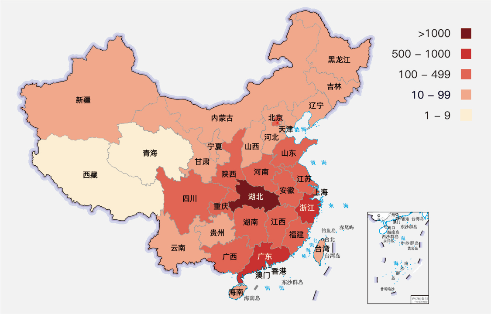
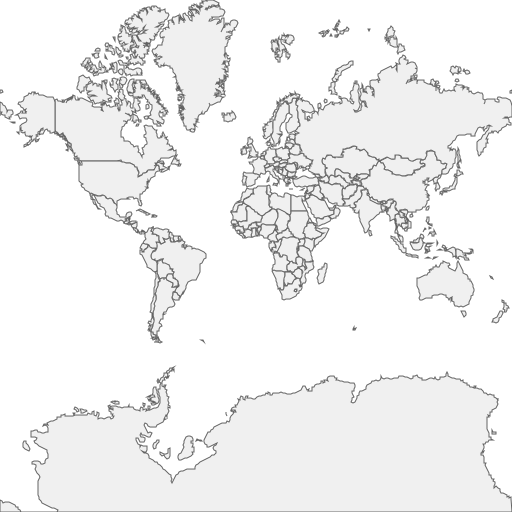
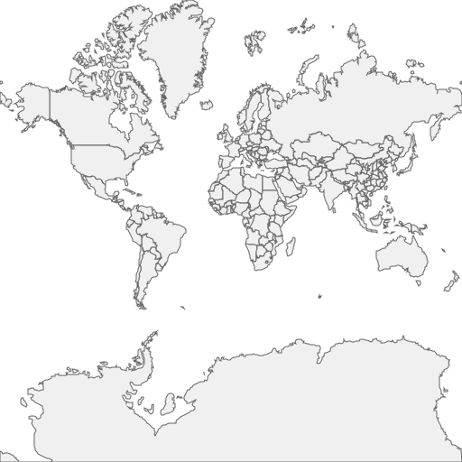
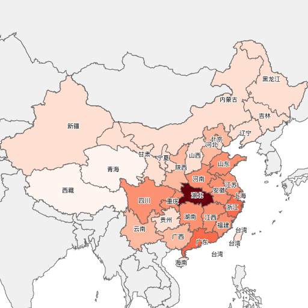
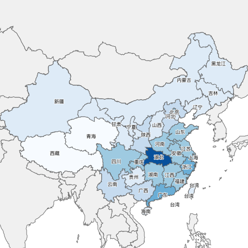

# 一张新型肺炎地区分布地图是怎么制作的？

[Click here for the English Version](./README.md)

- [前言](#前言)
- [让我们从环境开始](#让我们从环境开始)
- [创建工程，添加引用](#创建工程添加引用)
- [GIS数据](#gis数据)
- [剩下的工作就很简单了](#剩下的工作就很简单了)
    - [叠加世界数据](#叠加世界数据)
    - [叠加中国数据](#叠加中国数据)
    - [调整可视范围](#调整可视范围)
    - [连接动态数据](#连接动态数据)
    - [样式化地图](#样式化地图)
- [写在最后](#写在最后)


## 前言
2020年刚开始，各钟不幸的消息满天飞。新型肺炎的蔓延，科比去世... 无时无刻让我感到痛楚。为了不给国家添乱，新年几天都在窝在家里。时不时拿起手机，观察一下现在病情蔓延情况。下面这张地图就是一张典型的GIS应用。



每当我看到这张静态图时，很想要知道几个信息无法获知。
1. 我们能通过颜色和图例比较一个省的确诊人数范围，看不到一个省具体患病人数。
1. 由于是一张静态图，我们没法获市级数据。如果地图可以拖动，放大缩小就简单多了。
1. 每次看到红色，心里都很焦虑。能换成其他颜色，我自己更加能接受点。

基于这两个小功能，我准备介绍一下怎么去制作一张地图。我准备分两个阶段来做介绍。
1. 先用最简洁的代码来生成一张静态图片。通过这个阶段，让我们认识一下`Ginkgoch`地图开发的`API`.
1. 当我们了解了`Ginkgoch`地图开发的`API`之后，我们就把这个程序改造成地图服务，让她和知名的地图前端库`Leaflet`合并开发一个可交互的地图，集成点有趣的功能。

这篇文章，我准备先从制作一张静态图片开始。

> [`Ginkgoch`地图开发套件](https://ginkgoch.com)是一个GIS全栈开发套件。用一种语言 - `JavaScript` 就可以开发地图相关的命令行程序，地图桌面程序，以及地图服务。

## 让我们从环境开始
**以前开发地图应用软件**，可能需要掌握很多编程语言技能，才能胜任一个完整的项目。比如一个典型的GIS B/S应用一般会使用Java, C#或其他后端编程语言来开发后端，然后用JavaScript + HTML来开发前端展现。

今天我们使用`Ginkgoch`开发，就不再需要了解其他编程语言，用我们熟悉的JavaScript；即使是前端开发人员也可以开发后端地图应用了。追求极简开发环境的话，我们只需要2个工具。[Node.js](https://nodejs.org) （推荐8以上，或者直接安装最新版本都是兼容的）和 [vscode](https://code.visualstudio.com/).

> 这篇文章照顾新手，写的比较多。老鸟请自行过滤。勿喷。

## 创建工程，添加引用
接着，我们创建一个工程目录。用以下命令就可以了。（我个人比较喜欢使用命令行，由于平时都是用macOS做日常使用机器。所以以下命令行都是macOS执行验证的）。

```bash
# 创建项目目录
cd [your workspace]
md nCoV-map
cd nCoV-map

# 创建项目，添加引用
npm init -y
npm i --save ginkgoch-map canvas lodash

# 新建一个文件，这个将是我们写代码的地方
touch tutorial-01.js
```

> 这里引用了`canvas`库，是因为`Node.js`没有提供绘图API，我们只能引用一个第三方`Node.js`库来替代使用。

到这里，我们的工程已经建立好了。

## GIS数据
GIS应用里面数据是很重要的。我把她分为静态数据和动态数据。静态数据就是我们的几何图形以及她们特定的特征数据。如地区的名字等。动态数据就是我们实时关注的疫情变化。

一般**静态数据**比较容易找到。百度搜索中国地图数据csv, json, shapefile都可以找到。这个项目里面，我准备使用shapefile作为我的静态数据。[这里](https://github.com/ginkgoch/nCoV-map/tree/develop/data)你可以找到以下数据，我们一会儿会使用到。把上面数据下载下来以后，放到工程的`data`目录下面。

- chn/
    - gadm36_CHN_1_3857.shp - 省级数据
    - gadm36_CHN_2_3857.shp - 市级数据
- cntry02.shp - 世界国家数据

**动态数据**会麻烦点。我是写了一个爬虫，定时爬取。有兴趣可以私聊。不过作为例子，我放上了几份疫情数据在`data/infected`目录里面以便做示例。

## 剩下的工作就很简单了

### 叠加世界数据
首先，我们定义一个函数来创建一个地图的图层，一个数据源即一个数据图层，多个数据图层叠加起来就可以构成我们期望的样式。使用`ginkgoch-map`，我们是这样定义一个图层的。

```javascript
function createLayerWithDefaultStyle(filePath) {
    // create a source with the specified shapefile file path
    let source = new GK.ShapefileFeatureSource(path.resolve(__dirname, filePath));

    // wrap the source as a world layer
    let layer = new GK.FeatureLayer(source);

    // set a style on the layer
    layer.styles.push(new GK.FillStyle('#f0f0f0', '#636363', 1));

    return layer;
}
```

有了`layer`, 我们可以简单查看我们数据图层的样子。比如对于数据`cntry02.shp`:
```
let worldLayer = createLayerWithDefaultStyle('../data/cntry02.shp');
await worldLayer.open();
let worldImage = await worldLayer.thumbnail(512, 512);
fs.writeFileSync(path.resolve(__dirname, './images/tutorial-01-world.png'), worldImage.toBuffer());
```

我们通过命令行执行下面的语句。我们可以找到图片：
```bash
node tutorial-01.js
```



### 叠加中国数据

当然这个不是我们想要的样子，我们还需要把省份的数据叠加在上面，才能看到我们中国详细一点的数据。我们接着做。

```javascript
const [imageWidth, imageHeight] = [512, 512];

// create a world layer with cntry02.shp
let worldLayer = createLayerWithDefaultStyle('../data/cntry02.shp');

// create a province layer with gadm36_CHN_1_3857.shp
let provinceLayer = createLayerWithDefaultStyle('../data/chn/gadm36_CHN_1_3857.shp');

let mapEngine = new GK.MapEngine(imageWidth, imageHeight);
mapEngine.srs = new GK.Srs('EPSG:900913');
mapEngine.pushLayer(worldLayer);
mapEngine.pushLayer(provinceLayer);

let image = await mapEngine.image();
fs.writeFileSync(path.resolve(__dirname, './images/tutorial-01-default.png'), image.toBuffer());
```

现在再打开图片`tutorial-01-default.png`, 注意查看中国的数据已经叠加成功了。



### 调整可视范围

哦？太小了~ 好，我们调整下地图的可视范围。

```javascript
await provinceLayer.open();
let chinaEnvelope = await provinceLayer.envelope();
chinaEnvelope = GK.ViewportUtils.adjustEnvelopeToMatchScreenSize(chinaEnvelope, imageWidth, imageHeight);

let image = await mapEngine.image(chinaEnvelope);
fs.writeFileSync(path.resolve(__dirname, './images/tutorial-01-china.png'), image.toBuffer());
```


### 连接动态数据

我们对静态数据进行了渲染，同时对中国省份级别的边框进行绘制。接下来，我们将连接动态数据，把动态的感染人数和地图对应起来。我们怎么做呢？

首先，我们先看下静态数据的特征数据。Shapefile的特征数据存放在*.dbf文件里面。你可以选择使用你常用的工具打开dbf文件。我个人一般使用的是`shapefile viewer`来查看。参考[这里获取程序及使用说明](https://github.com/ginkgoch/node-shapefile-viewer)。


`NL_NAME_1`就是我们需要的省份名字，然后我们来看看动态数据的一个片段。

```json
[
    {
        "provinceName": "湖北省",
        "provinceShortName": "湖北",
        "confirmedCount": 4586,
        "suspectedCount": 0,
        "curedCount": 90,
        "deadCount": 162,
        "comment": "待明确地区：治愈 30",
        "cities": [
            {
                "cityName": "武汉",
                "confirmedCount": 2261,
                "suspectedCount": 0,
                "curedCount": 54,
                "deadCount": 129
            },
            {
                "cityName": "黄冈",
                "confirmedCount": 496,
                "suspectedCount": 0,
                "curedCount": 5,
                "deadCount": 12
            },
            ...
```

有趣的是，动态数据也包含省份的名字`provinceShortName`；以及感染，疑似，治愈以及死亡的人数。现在，我们要做的就是通过静态数据的`NL_NAME_1`和动态数据的`provinceShortName`相等的数据相关联。在`ginkgoch-map`里面是这样做的。

首先，我们定义一个函数来帮助我们定义一个关系。
```javascript
/**
 * field - the dynamic field value to return.
 * infectedData - the infected data in JSON format.
 */
function _getDynamicFieldForProvince(field, infectedData) {
    return {
        name: field, fieldsDependOn: ['NL_NAME_1'], mapper: feature => {
            const fullName = feature.properties.get('NL_NAME_1');
            const infectionInfo = _.find(infectedData, d => {
                return fullName.includes(d.provinceShortName);
            });

            if (infectionInfo === undefined) {
                return undefined;
            } else {
                return infectionInfo[field];
            }
        }
    };
}
```

然后建立4个列的映射函数。
```javascript
function connectDynamicData(layer) {
    // load dynamic data
    let dynamicData = fs.readFileSync(path.resolve(__dirname, '../data/infected/1580376765333.json')).toString();
    dynamicData = JSON.parse(dynamicData);
    
    // connect 4 dynamic attribute fields to the source.
    const source = layer.source;
    source.dynamicFields.push(_getDynamicFieldForProvince('confirmedCount', dynamicData));
    source.dynamicFields.push(_getDynamicFieldForProvince('suspectedCount', dynamicData));
    source.dynamicFields.push(_getDynamicFieldForProvince('curedCount', dynamicData));
    source.dynamicFields.push(_getDynamicFieldForProvince('deadCount', dynamicData));
}
```

最后，我们调用这个函数进行映射。
```javascript
//...省略前后重复的代码
let provinceLayer = createLayerWithDefaultStyle('../data/chn/gadm36_CHN_1_3857.shp');
connectDynamicData(provinceLayer);
```

至此，我们可以认为`provinceLayer`已经包含了动态数据。她将在需要的时候动态的去通过映射关系找到需要的数据来使用。

### 样式化地图
做到这里，大家可以去休息一下。迎接最后一步：地图样式化。我们把感染人数分成几个等级，根据等级渲染不同的颜色来表示严重程度。比较好的是，`ginkgoch-map`提供了对应的API来渲染。

我们先定义个函数来创建样式化对象`Style`.

```javascript
function _getClassBreakStyle(field) {
    const strokeColor = '#636363';
    const strokeWidth = 1;

    let countStops = [1, 10, 50, 100, 300, 500, 750, 1000, Number.MAX_SAFE_INTEGER];
    let activePallette = ['#fff5f0', '#fee0d2', '#fcbba1', '#fc9272', '#fb6a4a', '#ef3b2c', '#cb181d', '#67000d']
    let style = new GK.ClassBreakStyle(field);

    for (let i = 1; i < countStops.length; i++) {
        style.classBreaks.push({ minimum: countStops[i - 1], maximum: countStops[i], style: new GK.FillStyle(activePallette[i - 1], strokeColor, strokeWidth) });
    }

    return style;
}
```

再应用到`layer`上即可看到效果。
```javascript
let confirmedCountStyle = _getClassBreakStyle('confirmedCount');
provinceLayer.styles.push(confirmedCountStyle);

// 顺便我们把文字渲染上去，即可完成。
let provinceLabelStyle = new GK.TextStyle('[NL_NAME_1]', 'black', 'Arial 12px');
provinceLabelStyle.lineWidth = 2;
provinceLabelStyle.strokeStyle = 'white';
provinceLabelStyle.location = 'interior';
provinceLayer.styles.push(provinceLabelStyle);
```



是不是很有趣？我们现在可以随意替换调色板，让她变成蓝色系的。替换这一句即可。
```javascript
// let activePallette = ['#fff5f0', '#fee0d2', '#fcbba1', '#fc9272', '#fb6a4a', '#ef3b2c', '#cb181d', '#67000d'];
let activePallette = ['#f7fbff', '#deebf7', '#c6dbef', '#9ecae1', '#6baed6', '#4292c6', '#2171b5', '#08519c'];
```



## 写在最后
最终的代码可以在这里下载：https://github.com/ginkgoch/nCoV-map/tree/develop/tutorials

看起来很多，大多数代码都是业务代码，和对样式的设置。了解起来还是挺简单的。今天就到这里，后面有时间，我再写一篇搭建一个地图服务，制作一个可以交互的地图应用。有问题可以随时联系我,[ginkgoch@outlook.com](mailto:ginkgoch@outlook.com)。或者到我的网站[ginkgoch.com](https://ginkgoch.com)上去留言。

Happy Mapping!